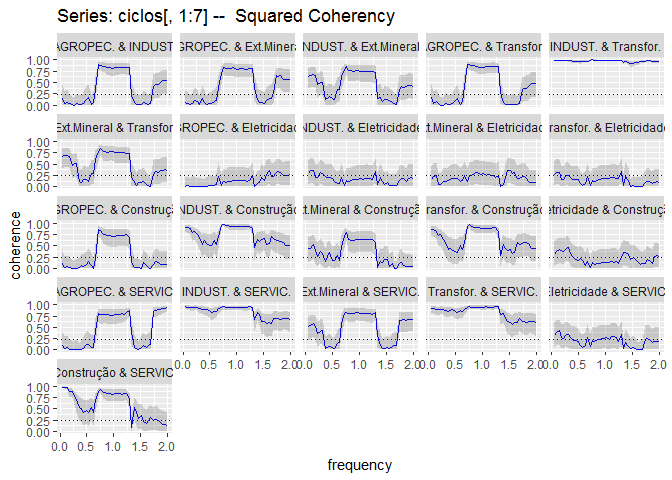
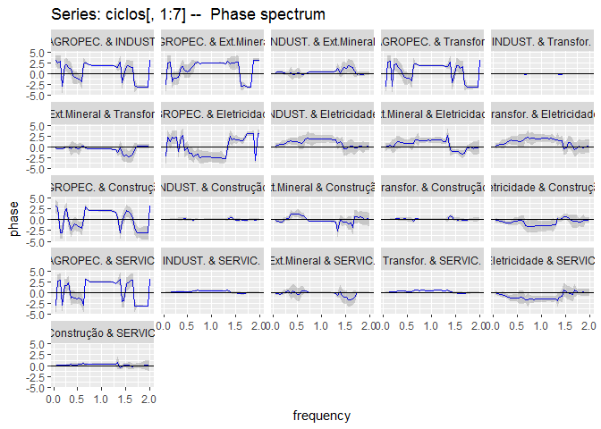
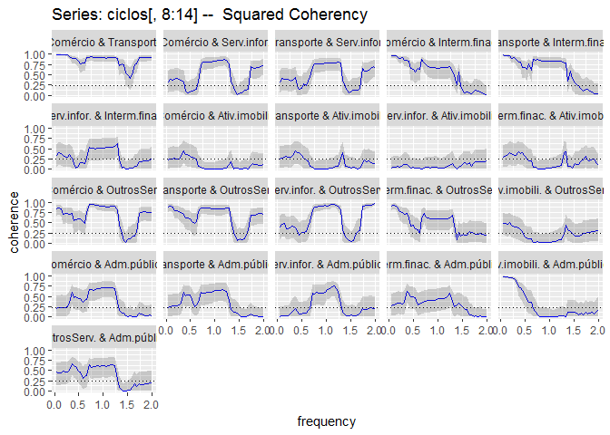
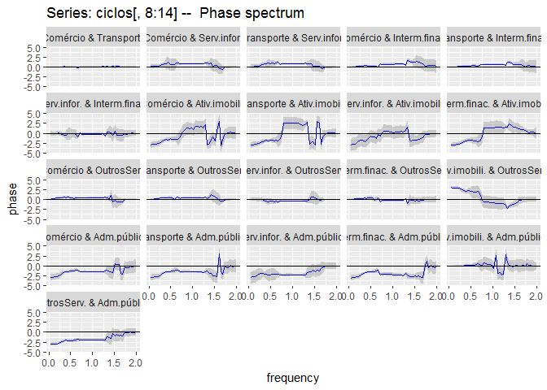

mecnost
=======

Modelos estruturais de componentes não obserados para séries temporais
----------------------------------------------------------------------

This package provides functions used in the Project

Installation
------------

The package can then be installed using
`devtools::install_github('santoscs/mecnost')`.

Data visualiation
-----------------

Os dados são PIB trimestral dos setores extraídos das contas nacionais
do IBGE no período de 1996Q1 a 2016Q3.

As séries temporais são mostradas na figuras seguir:

Estimando os modelos
--------------------

Estima os modelos por MCMC

Mostra o gráfico dos componentes estimados
------------------------------------------

Mostra o valores dos parâmetros estimados
-----------------------------------------

<table>
<thead>
<tr class="header">
<th></th>
<th></th>
<th align="left">phi1</th>
<th align="left">phi2</th>
<th align="left">sigma-trend</th>
<th align="left">sigma-txcresc</th>
<th align="left">sigma-ciclo</th>
</tr>
</thead>
<tbody>
<tr class="odd">
<td>AGROPEC.</td>
<td>Estimativas (dp)</td>
<td align="left">-0,261 (0,004)</td>
<td align="left">-0,420 (0,004)</td>
<td align="left">0,031 (0,001)</td>
<td align="left">0,017 (3e-04)</td>
<td align="left">0,161 (4e-04)</td>
</tr>
<tr class="even">
<td>r</td>
<td>quantil [5% ; 95%]</td>
<td align="left">[-0,438 ; -0,090]</td>
<td align="left">[-0,589 ; -0,235]</td>
<td align="left">[0,017 ; 0,050]</td>
<td align="left">[0,011 ; 0,024]</td>
<td align="left">[0,139 ; 0,188]</td>
</tr>
<tr class="odd">
<td>INDUST.</td>
<td>Estimativas (dp)</td>
<td align="left">0,002 (0,002)</td>
<td align="left">-0,888 (0,003)</td>
<td align="left">0,031 (3e-04)</td>
<td align="left">0,015 (2e-04)</td>
<td align="left">0,017 (3e-04)</td>
</tr>
<tr class="even">
<td>r</td>
<td>quantil [5% ; 95%]</td>
<td align="left">[-0,079 ; 0,080]</td>
<td align="left">[-0,970 ; -0,775]</td>
<td align="left">[0,022 ; 0,038]</td>
<td align="left">[0,011 ; 0,020]</td>
<td align="left">[0,012 ; 0,025]</td>
</tr>
<tr class="odd">
<td>Ext.Mineral</td>
<td>Estimativas (dp)</td>
<td align="left">0,003 (0,005)</td>
<td align="left">-0,693 (0,013)</td>
<td align="left">0,031 (0,001)</td>
<td align="left">0,016 (2e-04)</td>
<td align="left">0,026 (0,001)</td>
</tr>
<tr class="even">
<td>r</td>
<td>quantil [5% ; 95%]</td>
<td align="left">[-0,171 ; 0,216]</td>
<td align="left">[-0,912 ; -0,413]</td>
<td align="left">[0,020 ; 0,043]</td>
<td align="left">[0,011 ; 0,022]</td>
<td align="left">[0,016 ; 0,038]</td>
</tr>
<tr class="odd">
<td>Transfor.</td>
<td>Estimativas (dp)</td>
<td align="left">-0,001 (0,001)</td>
<td align="left">-0,904 (0,004)</td>
<td align="left">0,045 (4e-04)</td>
<td align="left">0,016 (2e-04)</td>
<td align="left">0,021 (4e-04)</td>
</tr>
<tr class="even">
<td>r</td>
<td>quantil [5% ; 95%]</td>
<td align="left">[-0,074 ; 0,070]</td>
<td align="left">[-0,978 ; -0,785]</td>
<td align="left">[0,033 ; 0,055]</td>
<td align="left">[0,012 ; 0,023]</td>
<td align="left">[0,013 ; 0,033]</td>
</tr>
<tr class="odd">
<td>Eletricidade</td>
<td>Estimativas (dp)</td>
<td align="left">0,760 (0,011)</td>
<td align="left">-0,023 (0,004)</td>
<td align="left">0,023 (2e-04)</td>
<td align="left">0,015 (1e-04)</td>
<td align="left">0,021 (2e-04)</td>
</tr>
<tr class="even">
<td>r</td>
<td>quantil [5% ; 95%]</td>
<td align="left">[0,300 ; 1,075]</td>
<td align="left">[-0,249 ; 0,180]</td>
<td align="left">[0,016 ; 0,030]</td>
<td align="left">[0,011 ; 0,020]</td>
<td align="left">[0,015 ; 0,027]</td>
</tr>
<tr class="odd">
<td>Construção</td>
<td>Estimativas (dp)</td>
<td align="left">0,019 (0,003)</td>
<td align="left">-0,831 (0,003)</td>
<td align="left">0,023 (2e-04)</td>
<td align="left">0,017 (2e-04)</td>
<td align="left">0,017 (1e-04)</td>
</tr>
<tr class="even">
<td>r</td>
<td>quantil [5% ; 95%]</td>
<td align="left">[-0,094 ; 0,143]</td>
<td align="left">[-0,942 ; -0,699]</td>
<td align="left">[0,016 ; 0,030]</td>
<td align="left">[0,012 ; 0,023]</td>
<td align="left">[0,012 ; 0,022]</td>
</tr>
<tr class="odd">
<td>SERVIC.</td>
<td>Estimativas (dp)</td>
<td align="left">0,057 (0,004)</td>
<td align="left">-0,644 (0,008)</td>
<td align="left">0,017 (1e-04)</td>
<td align="left">0,012 (8e-05)</td>
<td align="left">0,015 (2e-04)</td>
</tr>
<tr class="even">
<td>r</td>
<td>quantil [5% ; 95%]</td>
<td align="left">[-0,108 ; 0,250]</td>
<td align="left">[-0,836 ; -0,388]</td>
<td align="left">[0,013 ; 0,022]</td>
<td align="left">[0,009 ; 0,015]</td>
<td align="left">[0,011 ; 0,019]</td>
</tr>
<tr class="odd">
<td>Comércio</td>
<td>Estimativas (dp)</td>
<td align="left">0,019 (0,002)</td>
<td align="left">-0,808 (0,007)</td>
<td align="left">0,030 (3e-04)</td>
<td align="left">0,015 (1e-04)</td>
<td align="left">0,019 (4e-04)</td>
</tr>
<tr class="even">
<td>r</td>
<td>quantil [5% ; 95%]</td>
<td align="left">[-0,087 ; 0,125]</td>
<td align="left">[-0,936 ; -0,639]</td>
<td align="left">[0,021 ; 0,038]</td>
<td align="left">[0,011 ; 0,020]</td>
<td align="left">[0,012 ; 0,028]</td>
</tr>
<tr class="odd">
<td>Transporte</td>
<td>Estimativas (dp)</td>
<td align="left">0,018 (0,002)</td>
<td align="left">-0,814 (0,008)</td>
<td align="left">0,034 (5e-04)</td>
<td align="left">0,015 (2e-04)</td>
<td align="left">0,021 (0,001)</td>
</tr>
<tr class="even">
<td>r</td>
<td>quantil [5% ; 95%]</td>
<td align="left">[-0,090 ; 0,132]</td>
<td align="left">[-0,946 ; -0,622]</td>
<td align="left">[0,023 ; 0,043]</td>
<td align="left">[0,011 ; 0,020]</td>
<td align="left">[0,013 ; 0,032]</td>
</tr>
<tr class="odd">
<td>Serv.infor.</td>
<td>Estimativas (dp)</td>
<td align="left">0,138 (0,014)</td>
<td align="left">0,037 (0,011)</td>
<td align="left">0,028 (0,001)</td>
<td align="left">0,015 (2e-04)</td>
<td align="left">0,031 (5e-04)</td>
</tr>
<tr class="even">
<td>r</td>
<td>quantil [5% ; 95%]</td>
<td align="left">[-0,252 ; 0,631]</td>
<td align="left">[-0,259 ; 0,439]</td>
<td align="left">[0,017 ; 0,042]</td>
<td align="left">[0,011 ; 0,020]</td>
<td align="left">[0,021 ; 0,040]</td>
</tr>
<tr class="odd">
<td>Interm.finac.</td>
<td>Estimativas (dp)</td>
<td align="left">0,001 (0,001)</td>
<td align="left">-0,913 (0,002)</td>
<td align="left">0,023 (2e-04)</td>
<td align="left">0,013 (1e-04)</td>
<td align="left">0,018 (2e-04)</td>
</tr>
<tr class="even">
<td>r</td>
<td>quantil [5% ; 95%]</td>
<td align="left">[-0,063 ; 0,065]</td>
<td align="left">[-0,972 ; -0,840]</td>
<td align="left">[0,016 ; 0,029]</td>
<td align="left">[0,010 ; 0,017]</td>
<td align="left">[0,014 ; 0,024]</td>
</tr>
<tr class="odd">
<td>Ativ.imobili.</td>
<td>Estimativas (dp)</td>
<td align="left">0,946 (0,007)</td>
<td align="left">-0,019 (0,006)</td>
<td align="left">0,011 (5e-05)</td>
<td align="left">0,011 (6e-05)</td>
<td align="left">0,011 (5e-05)</td>
</tr>
<tr class="even">
<td>r</td>
<td>quantil [5% ; 95%]</td>
<td align="left">[0,692 ; 1,177]</td>
<td align="left">[-0,229 ; 0,157]</td>
<td align="left">[0,009 ; 0,014]</td>
<td align="left">[0,009 ; 0,013]</td>
<td align="left">[0,009 ; 0,014]</td>
</tr>
<tr class="odd">
<td>OutrosServ.</td>
<td>Estimativas (dp)</td>
<td align="left">0,080 (0,010)</td>
<td align="left">-0,337 (0,015)</td>
<td align="left">0,022 (4e-04)</td>
<td align="left">0,013 (1e-04)</td>
<td align="left">0,024 (3e-04)</td>
</tr>
<tr class="even">
<td>r</td>
<td>quantil [5% ; 95%]</td>
<td align="left">[-0,176 ; 0,453]</td>
<td align="left">[-0,732 ; 0,038]</td>
<td align="left">[0,015 ; 0,032]</td>
<td align="left">[0,009 ; 0,018]</td>
<td align="left">[0,016 ; 0,032]</td>
</tr>
<tr class="odd">
<td>Adm.pública</td>
<td>Estimativas (dp)</td>
<td align="left">0,936 (0,007)</td>
<td align="left">-0,022 (0,005)</td>
<td align="left">0,012 (6e-05)</td>
<td align="left">0,011 (6e-05)</td>
<td align="left">0,012 (6e-05)</td>
</tr>
<tr class="even">
<td>r</td>
<td>quantil [5% ; 95%]</td>
<td align="left">[0,656 ; 1,167]</td>
<td align="left">[-0,223 ; 0,166]</td>
<td align="left">[0,010 ; 0,015]</td>
<td align="left">[0,008 ; 0,013]</td>
<td align="left">[0,009 ; 0,014]</td>
</tr>
</tbody>
</table>

Gráficos para coherence e fase dos ciclos
-----------------------------------------

